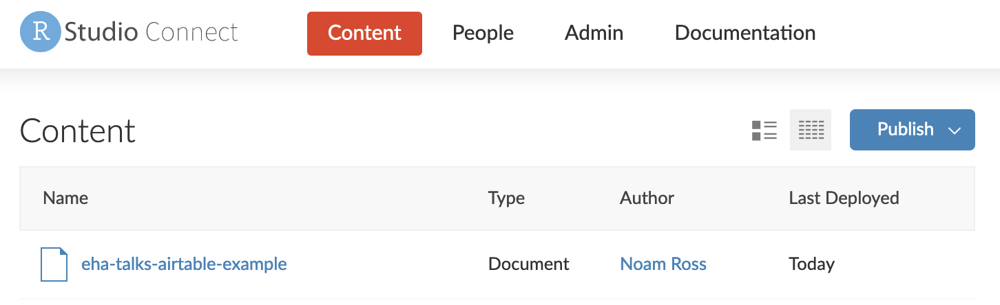
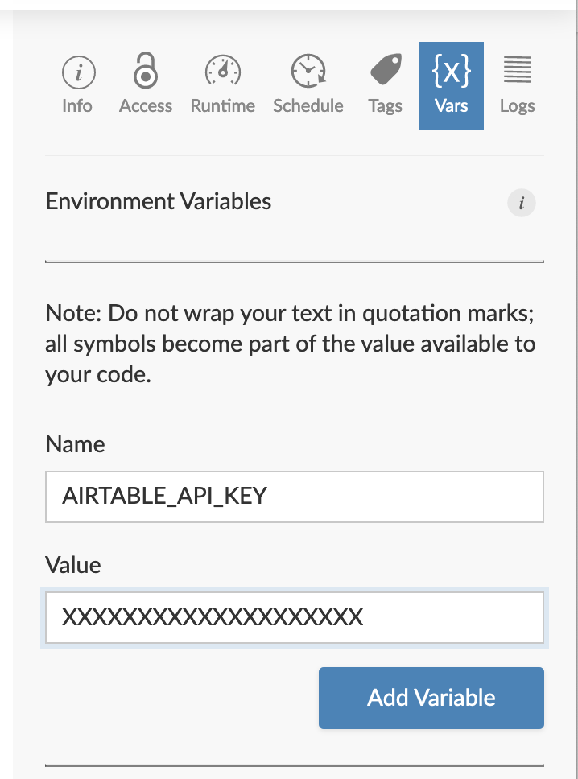

This is an example R Markdown report to show how to fetch data from AirTable
for a regular scheduled report.  

In the first code chunk, we load our libraries

```{r setup, include=FALSE}
# You'll want the `airtabler` package to interface with AirTable. Get it by
# running remotes::install_github('bergant/airtabler')
library(airtabler) 

# I'm also loading the `tidyverse` package for data handling and plotting tools
library(tidyverse)
```

Now, we need to connect to AirTable. This requires two pieces of information:
you airtable _API key_, which is a personal password, and the _base ID_ which
is the ID of the base you are pulling data from.  To get your API key, go to:

https://airtable.com/account

There you can generate an API key.  To use this locally on your machine,
put in in your _R Environment File_, or `.Renviron`. Run `usethis::edit_r_environ()`,
and put copy key in that file on a new line like so:

    AIRTABLE_API_KEY=XXXXXXXXXXXXXXXXXXX
    
Now, whenever you run R, it will know your API key, without you having to put
this secure information in your code. Keep the `.Renviron` file open
Later we will insert add this key to the RStudio Connect in a secure way.

To get your _base ID_, go to:

https://airtable.com/api

You will see a list of bases you have access to.  Here I select the EHA Science
Talks base. The page you reach will have a line like this:

> The ID of this base is `appwlxIzmQx5njRtQ`

With this ID, you can fetch any of your bases.

```{r}
# Here I import the "talks" table for the EHA Science Talks base
talks <- air_get("appwlxIzmQx5njRtQ", "Talks")
```

Now one can manipulate this data to produce a chart:

```{r}
talks2 <- talks %>% 
  mutate(date = as.Date(as.POSIXct(`Date / Time`))) %>% 
  filter(date < Sys.Date(), date > as.Date("2020-08-01")) %>% 
  unnest(Type) %>% 
  filter(Type != "External Talk")
ggplot(talks2, aes(x = Type)) +
    geom_bar() +
    theme(axis.text.x = element_text(angle = 90)) + 
    labs(title = paste("Categories of Talks Since", as.Date(min(talks2$date))))
```

Your report can be deployed following the steps in the [tutorial on publishing an
R Markdown Document](https://docs.rstudio.com/how-to-guides/users/basic/publish-rmd/).
However, the first time you publish, you will probably get an error message that
looks like this:

```
...
[Connect] 2021/03/05 20:06:34.115492584 Additional data:
[Connect] Expression: 'air_api_key()'
[Connect] Message: 'AIRTABLE_API_KEY environment variable is empty. See ?airtabler for help.'
[Connect] Found in the following log entry:
[Connect] 2021/03/05 20:06:34.115364739 Error in air_api_key() : 
...
```

Why? Because when your document runs on the RStudio Connect server, it does not
have the _API Key_ needed to securely connect to your airtable account. To add
it, go to <https://connect.eha.io> and find your newly deployed document in the
"Content" tab:



Then find the "{X} Vars" button on the right, click on it, and enter the name
and value of your API key from your `.Renviron` file, like so:

{width=325px}

Now hit the refresh button (), and see your document re-rendered.

Once you have entered the API key into RStudio Connect, is is stored indefinitely
_for that document only_. You can update and redeploy the same file, schedule
regular automated runs, and send reports as emails without needing to  add it again,
but for a _new_ report, you will want to add any relevant API keys.

